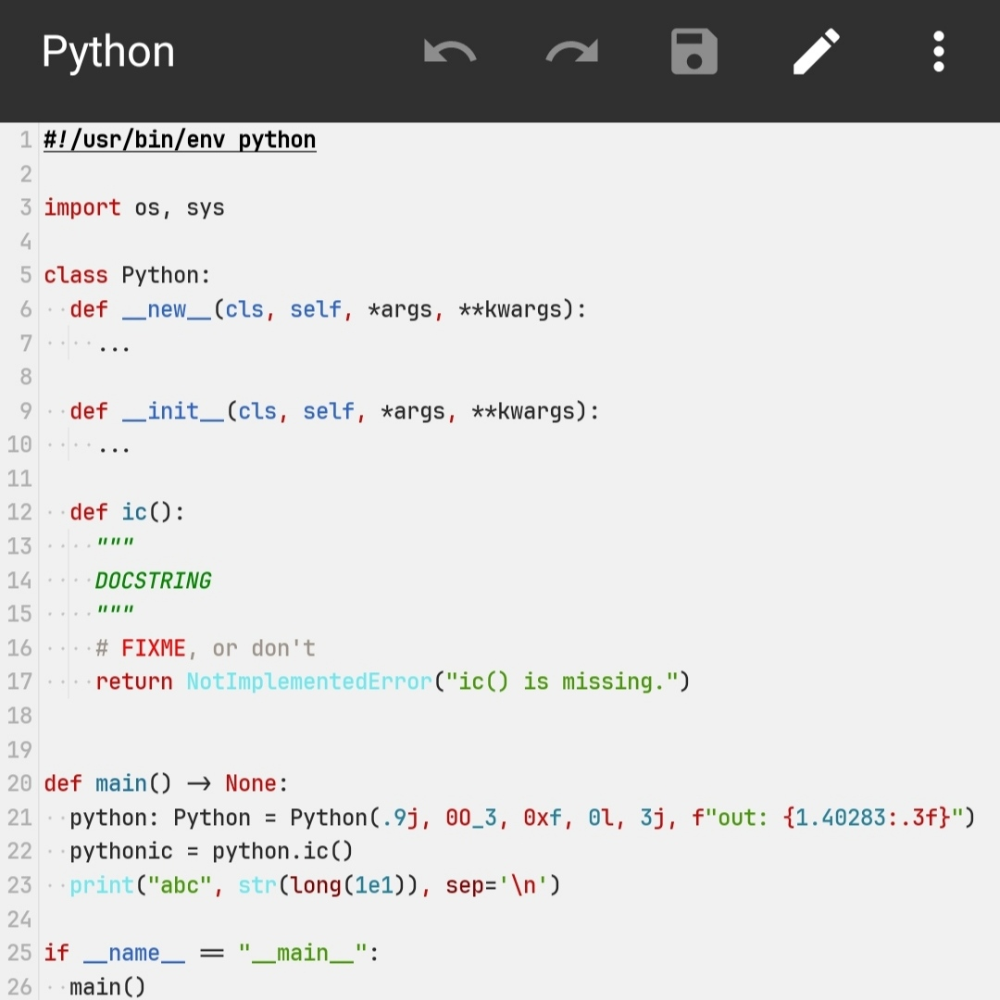
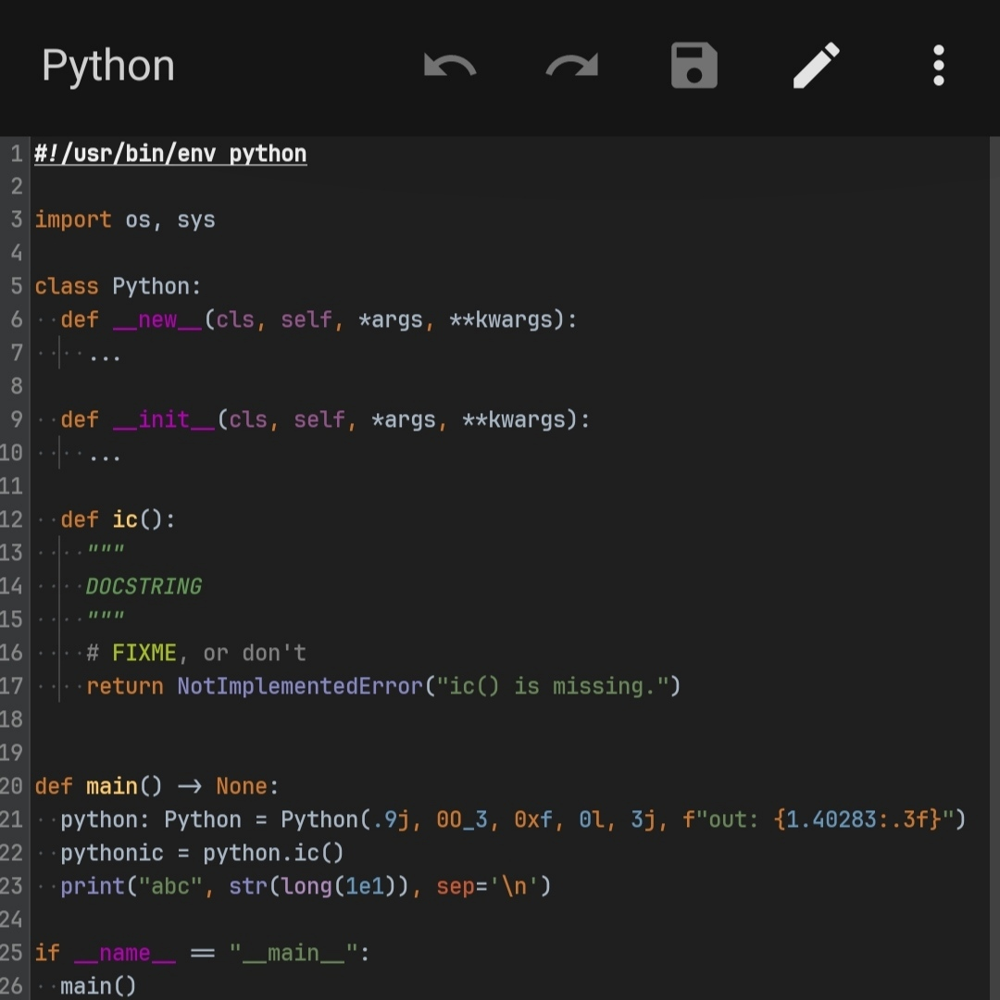

# PythonMTSX
Python Syntax for MT Manager application


# Requirements
MT Manager version 2.16.0 at least


# Setup
clone this repo
```sh
git clone https://github.com/SENPAi-03/PythonMTSX
```
open [Python.mtsx](https://github.com/SENPAi-03/PythonMTSX/blob/main/Python.mtsx) file with your [MT Manager](https://mt2.cn/download/) app and choose **Install**


# Preview
> Light Mode


> Dark Mode


